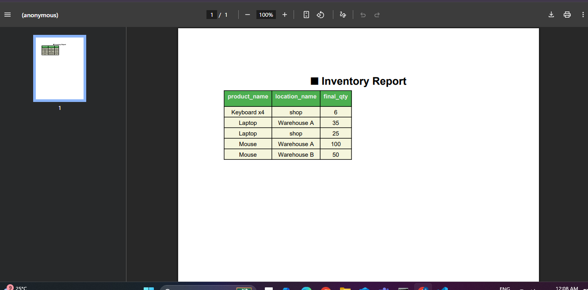
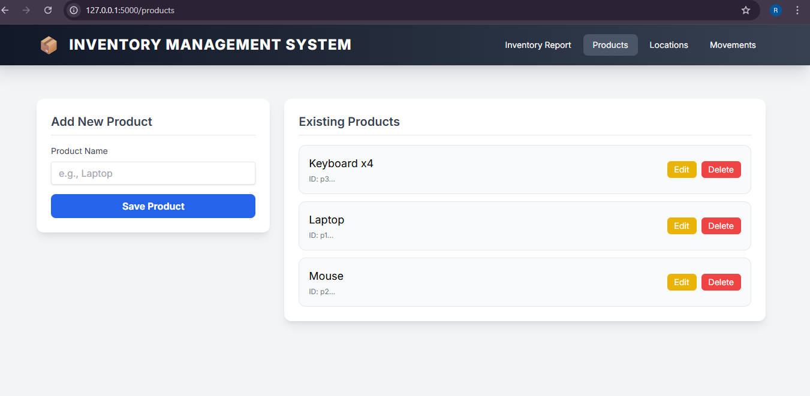
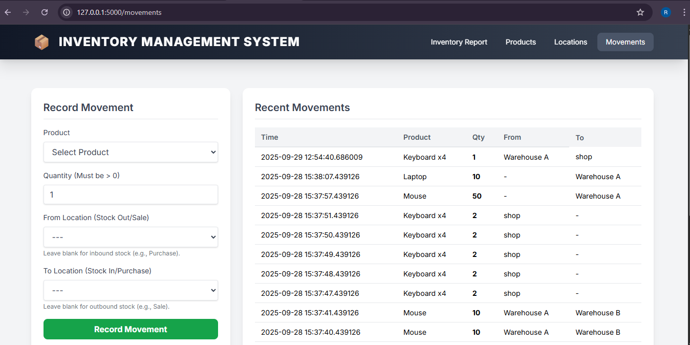
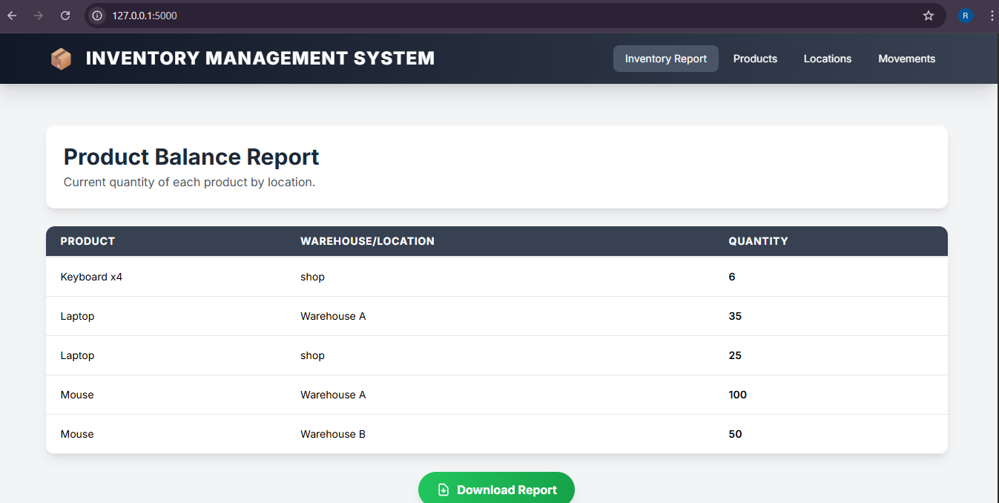

# 📦 Inventory Management System

A comprehensive, professional inventory management system built with Flask that provides complete functionality for managing products, locations, and tracking inventory movements.

## 🚀 Features

### Core Functionality
- **Product Management**: Add, edit, delete products with data integrity protection
- **Location Management**: Manage warehouses and storage locations  
- **Movement Tracking**: Record stock movements (purchases, sales, transfers)
- **Inventory Reporting**: Real-time inventory balance reports
- **PDF Export**: Download professional inventory reports

## 🛠️ Technology Stack

- **Backend**: Flask (Python 3.8+)
- **Database**: SQLite with proper foreign key constraints
- **Frontend**: HTML5, Tailwind CSS, Vanilla JavaScript
- **PDF Generation**: ReportLab
- **Icons**: Lucide Icons

## 📋 Prerequisites

- Python 3.8 or higher
- Virtual environment (recommended)

## 🔧 Installation

1. **Clone or extract the project**
   ```bash
   cd Invention_Flask
   ```

2. **Create and activate virtual environment**
   ```bash
   # Windows
   python -m venv .venv
   .venv\\Scripts\\activate

   # Linux/Mac
   python -m venv .venv
   source .venv/bin/activate
   ```

3. **Install dependencies**
   ```bash
   pip install flask reportlab
   ```

4. **Run the application**
   ```bash
   python app.py
   ```

5. **Access the application**
   - Open your browser and go to: `http://127.0.0.1:5000`

## 📁 Project Structure

```
Invention_Flask/
├── app.py                 # Main Flask application
├── database.py           # Database operations and models
├── inventory.db          # SQLite database (auto-created)
├── templates/
│   └── index.html        # Main HTML template
├── __pycache__/          # Python cache files
└── README.md            # This file
```

## 🎯 Usage Guide

### Dashboard (Inventory Report)
- View current stock levels by product and location
- Download PDF reports
- Quick overview of inventory status

### Product Management
- **Add Products**: Use the form to add new products
- **Edit Products**: Click "Edit" button on any product
- **Delete Products**: Click "Delete" with confirmation (blocked if movement history exists)

### Location Management
- **Add Locations**: Create warehouses or storage locations
- **Edit Locations**: Modify location names
- **Delete Locations**: Remove unused locations (blocked if movement history exists)

### Movement Tracking
- **Record Movements**: Track stock in/out/transfers
- **Movement Types**:
  - **Purchase**: Leave "From" empty, select "To" location
  - **Sale**: Select "From" location, leave "To" empty  
  - **Transfer**: Select both "From" and "To" locations
- **View History**: See recent movements in real-time

## 🔧 Configuration

The application supports environment variables for configuration:

```bash
# Optional environment variables
FLASK_DEBUG=True          # Enable debug mode
FLASK_HOST=127.0.0.1      # Host address
FLASK_PORT=5000           # Port number
SECRET_KEY=your_secret    # Flask secret key
```


### Adding Features
1. **New Routes**: Add to appropriate section in `app.py`
2. **Database Changes**: Modify `database.py`
3. **UI Updates**: Update `templates/index.html`
4. **Styling**: Use existing Tailwind classes for consistency

## 📝 License

This project is for educational and development purposes.

---

**Author**: Flask Inventory System  
**Version**: 1.0.0  
**Date**: October 3, 2025
## Screenshots

### Inventory Report


### Products Page


### Movements Page


### Location Report


### Balance  Report

